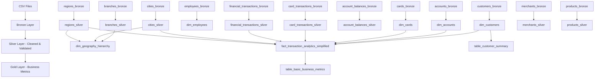

# KOMPLETNÍ DOKUMENTACE BANKOVNÍ DATABÁZE RAIFFKA

## ARCHITEKTURA SYSTÉMU

Systém používá **medallion architekturu** se třemi vrstvami:
- **BRONZE** - Raw data (zdrojová data bez transformací)
- **SILVER** - Cleaned & validated data (očištěná a validovaná data)
- **GOLD** - Business metrics & aggregations (business metriky a agregace)

---

## BRONZE VRSTVA - ZDROJOVÁ DATA

## KOMPLETNÍ PŘEHLED BRONZE TABULEK

Bronze vrstva obsahuje **12 tabulek** načítaných ze souborů CSV pomocí cloudFiles streaming:

| Tabulka | Typ dat | Snapshoty | Streaming | Popis |
|---------|---------|-----------|-----------|-------|
| `customers_bronze` | Dimenze | Ano | cloudFiles | Zákazníci banky |
| `accounts_bronze` | Dimenze | Ano | cloudFiles | Bankovní účty |
| `cards_bronze` | Dimenze | Ano | cloudFiles | Platební karty |
| `employees_bronze` | Dimenze | Ano | cloudFiles | Zaměstnanci banky |
| `branches_bronze` | Referenční | Ne | cloudFiles | Pobočky banky |
| `cities_bronze` | Referenční | Ne | cloudFiles | Města |
| `regions_bronze` | Referenční | Ne | cloudFiles | Regiony |
| `products_bronze` | Referenční | Ne | cloudFiles | Produkty banky |
| `merchants_bronze` | Referenční | Ne | cloudFiles | Obchodníci |
| `account_balances_bronze` | Faktová | Ne | cloudFiles | Zůstatky účtů |
| `card_transactions_bronze` | Faktová | Ne | cloudFiles | Kartové transakce |
| `financial_transactions_bronze` | Faktová | Ne | cloudFiles | Finanční transakce |

### TECHNICKÁ IMPLEMENTACE BRONZE VRSTVY

**CloudFiles streaming konfigurace:**
- **Format**: CSV s header=true
- **MultiLine**: true pro handling víceřádkových záznamů
- **Quote/Escape**: '"' pro správné parsování CSV
- **Auto schema detection**: Spark automaticky detekuje schéma

**Tabulky se snapshoty** (obsahují `snapshot_date`):
- `customers_bronze`, `accounts_bronze`, `cards_bronze`, `employees_bronze`
- Snapshot datum se extrahuje z file path pomocí regex: `/(\d{4}\.\d{2}\.\d{2})/`

**Tabulky bez snapshotů** (pouze `ingestion_ts`):
- Všechny ostatní tabulky - `branches_bronze`, `cities_bronze`, atd.

### SPOLEČNÉ TECHNICKÉ SLOUPCE (všechny bronze tabulky)

```sql
source_file          STRING    -- Cesta k zdrojovému souboru
ingestion_ts         TIMESTAMP -- Čas načtení do systému
snapshot_date        DATE      -- Datum snapshotů (jen u dimenzí)
```

---

## CUSTOMERS_BRONZE - ZÁKAZNÍCI

**Účel**: Základní informace o zákaznících banky včetně demografických údajů a finančních charakteristik.

### STRUKTURA SLOUPCŮ

| Sloupec | Typ | Popis | Příklad |
|---------|-----|-------|---------|
| `customer_id` | STRING | Unikátní identifikátor zákazníka | "CUST_001234" |
| `jmeno` | STRING | Křestní jméno | "Jan" |
| `prijmeni` | STRING | Příjmení | "Novák" |
| `adresa` | STRING | Kompletní adresa (ulice,město,PSČ) | "Hlavní 123, Praha, 11000" |
| `email` | STRING | E-mailová adresa | "jan.novak@email.cz" |
| `rodne_cislo` | STRING | Rodné číslo | "801201/1234" |
| `stav` | STRING | Stav zákazníka | "aktivní", "neaktivní" |
| `tel_cislo` | STRING | Telefonní číslo | "+420 123 456 789" |
| `datum_narozeni` | STRING | Datum narození | "1980-12-01" |
| `typ_bydleni` | STRING | Typ bydlení | "vlastní", "nájem" |
| `pracovni_stav` | STRING | Pracovní stav | "zaměstnaný", "podnikatel" |
| `pohlavi` | STRING | Pohlaví | "M", "F" |
| `pocet_clenu_domacnost` | STRING | Počet členů domácnosti | "4" |
| `datum_prvniho_otevreni_uctu` | STRING | Datum prvního účtu | "2020-03-15" |
| `zeme` | STRING | Země bydliště | "Česká republika" |
| `prijem` | STRING | Měsíční příjem v Kč | "45000.00" |
| `titul_pred` | STRING | Titul před jménem | "Ing." |
| `titul_za` | STRING | Titul za jménem | "Ph.D." |
| `sum_prm_uspor_12m` | STRING | Průměrné úspory za 12 měsíců | "150000.00" |
| `min_atm_amt` | STRING | Minimální výběr z bankomatu | "500.00" |
| `rezident` | STRING | Daňový rezident | "ano", "ne" |
| `pocet_nemovitosti` | STRING | Počet nemovitostí | "1" |

**Business význam**: Tabulka obsahuje kompletní profil zákazníka pro segmentaci, risk management a personalizované nabídky.

---

## ACCOUNTS_BRONZE - BANKOVNÍ ÚČTY

**Účel**: Informace o bankovních účtech zákazníků.

### STRUKTURA SLOUPCŮ

| Sloupec | Typ | Popis | Příklad |
|---------|-----|-------|---------|
| `account_id` | STRING | Unikátní ID účtu | "ACC_789012" |
| `customer_id` | STRING | ID vlastníka účtu | "CUST_001234" |
| `typ_uctu` | STRING | Typ účtu | "běžný", "spořicí", "termínovaný" |
| `stav` | STRING | Stav účtu | "aktivní", "uzavřený", "blokovaný" |
| `mena` | STRING | Měna účtu | "CZK", "EUR", "USD" |
| `datum_otevreni` | STRING | Datum otevření | "2020-03-15" |
| `datum_uzavreni` | STRING | Datum uzavření | "2023-12-31" |

**Business význam**: Sledování životního cyklu účtů, analýza produktového mixu zákazníků.

---

## CARDS_BRONZE - PLATEBNÍ KARTY

**Účel**: Informace o platebních kartách vydaných k účtům.

### STRUKTURA SLOUPCŮ

| Sloupec | Typ | Popis | Příklad |
|---------|-----|-------|---------|
| `card_id` | STRING | ID karty | "CARD_456789" |
| `account_id` | STRING | ID účtu | "ACC_789012" |
| `typ_karty` | STRING | Typ karty | "debetní", "kreditní", "firemní" |
| `stav` | STRING | Stav karty | "aktivní", "blokovaná", "expirovaná" |
| `platnost_do` | STRING | Datum expirace | "2025-12-31" |

**Business význam**: Správa kartového portfolia, analýza využití různých typů karet.

---

## EMPLOYEES_BRONZE - ZAMĚSTNANCI

**Účel**: Informace o zaměstnancích banky.

### STRUKTURA SLOUPCŮ

| Sloupec | Typ | Popis | Příklad |
|---------|-----|-------|---------|
| `employee_id` | STRING | ID zaměstnance | "EMP_001" |
| `jmeno` | STRING | Jméno | "Anna" |
| `prijmeni` | STRING | Příjmení | "Svobodová" |
| `role` | STRING | Pozice | "poradce", "manager", "ředitel" |
| `branch_id` | STRING | ID pobočky | "BRANCH_001" |

**Business význam**: HR analytics, přiřazování zákazníků k poradcům.

---

## BRANCHES_BRONZE - POBOČKY

**Účel**: Síť poboček banky.

### STRUKTURA SLOUPCŮ

| Sloupec | Typ | Popis | Příklad |
|---------|-----|-------|---------|
| `branch_id` | STRING | ID pobočky | "BRANCH_001" |
| `nazev` | STRING | Název pobočky | "Praha - Wenceslas" |
| `adresa` | STRING | Adresa pobočky | "Václavské náměstí 1, Praha, 11000" |
| `city_id` | STRING | ID města | "CITY_001" |

**Business význam**: Geografická distribuce služeb, optimalizace sítě poboček.

---

## GEOGRAFICKÉ ENTITY

### CITIES_BRONZE - MĚSTA
| Sloupec | Typ | Popis |
|---------|-----|-------|
| `city_id` | STRING | ID města |
| `nazev` | STRING | Název města |
| `region_id` | STRING | ID regionu |

### REGIONS_BRONZE - REGIONY
| Sloupec | Typ | Popis |
|---------|-----|-------|
| `region_id` | STRING | ID regionu |
| `nazev` | STRING | Název regionu |

**Business význam**: Geografická segmentace, regionální analýzy výkonnosti.

---

## REFERENČNÍ ENTITY

### PRODUCTS_BRONZE - PRODUKTY
| Sloupec | Typ | Popis |
|---------|-----|-------|
| `product_id` | STRING | ID produktu |
| `nazev` | STRING | Název produktu |
| `kategorie` | STRING | Kategorie produktu |

### MERCHANTS_BRONZE - OBCHODNÍCI
| Sloupec | Typ | Popis |
|---------|-----|-------|
| `merchant_id` | STRING | ID obchodníka |
| `nazev` | STRING | Název obchodníka |
| `kategorie` | STRING | Kategorie obchodu |

---

## FAKTOVÉ TABULKY - TRANSAKCE A ZŮSTATKY

### CARD_TRANSACTIONS_BRONZE - KARTOVÉ TRANSAKCE

**Účel**: Všechny transakce provedené platebními kartami.

| Sloupec | Typ | Popis | Příklad |
|---------|-----|-------|---------|
| `card_transaction_id` | STRING | ID transakce | "CT_123456" |
| `card_id` | STRING | ID karty | "CARD_456789" |
| `merchant_id` | STRING | ID obchodníka | "MERCH_001" |
| `amount` | STRING | Částka | "1250.50" |
| `datum` | STRING | Datum a čas | "2024-01-15 14:30:00" |
| `typ_transakce` | STRING | Typ transakce | "nákup", "výběr", "platba" |
| `city_id` | STRING | ID města transakce | "CITY_001" |
| `region_id` | STRING | ID regionu transakce | "REG_001" |

### FINANCIAL_TRANSACTIONS_BRONZE - FINANČNÍ TRANSAKCE

**Účel**: Bankovní převody, vklady, výběry a další finanční operace.

| Sloupec | Typ | Popis | Příklad |
|---------|-----|-------|---------|
| `transaction_id` | STRING | ID transakce | "FT_789012" |
| `account_id` | STRING | ID účtu | "ACC_789012" |
| `amount` | STRING | Částka | "5000.00" |
| `datum` | STRING | Datum a čas | "2024-01-15 09:15:00" |
| `typ_transakce` | STRING | Typ operace | "převod", "vklad", "výběr" |
| `city_id` | STRING | ID města | "CITY_001" |
| `region_id` | STRING | ID regionu | "REG_001" |

### ACCOUNT_BALANCES_BRONZE - ZŮSTATKY ÚČTŮ

**Účel**: Denní zůstatky na účtech pro sledování cash flow.

| Sloupec | Typ | Popis | Příklad |
|---------|-----|-------|---------|
| `account_id` | STRING | ID účtu | "ACC_789012" |
| `balance` | STRING | Zůstatek | "45780.25" |
| `datum` | STRING | Datum | "2024-01-15" |

**Business význam**: Analýza cash flow, likvidita, úrokové výnosy.

---

## SILVER VRSTVA - OČIŠTĚNÁ DATA

Silver vrstva představuje **"single source of truth"** pro všechna bankovní data. Transformuje raw data z Bronze do kvalitních, validovaných datových struktur s implementací **SCD Type 2** pro sledování historických změn.

### BUSINESS VÝZNAM SILVER VRSTVY

Silver vrstva je **páteří analytického systému banky** - obsahuje všechna důležitá data v konzistentním, validovaném formátu. Tato vrstva slouží jako:

- **Master Data Management (MDM)** - centralizovaná správa klíčových entit (zákazníci, účty, karty)
- **Data Quality Hub** - zajišťuje konzistenci a kvalitu dat napříč celou bankou
- **Historical Data Warehouse** - uchovává kompletní historii změn pro compliance a audit
- **Integration Layer** - propojuje různé zdrojové systémy do jednotného pohledu

**Kdo Silver vrstvu používá:**
- **Data Analytici** - pro ad-hoc analýzy a exploraci dat
- **Data Scientists** - jako základ pro machine learning modely
- **Compliance & Audit** - pro sledování historických změn a regulatorní reporty
- **IT systémy** - jako zdroj pro downstream aplikace

### KLÍČOVÉ TRANSFORMACE

1. **Data Quality & Validation**
   - Validace povinných polí
   - Karanténa špatných záznamů
   - Standardizace formátů

2. **SCD Type 2 Implementation**
   - Sledování historických změn
   - Sloupce `__START_AT`, `__END_AT`
   - Verzování záznamů

3. **Data Enrichment**
   - Parsování adres
   - Výpočet věku zákazníků
   - Geografické hierarchie

## KOMPLETNÍ PŘEHLED SILVER TABULEK

Silver vrstva obsahuje **25 tabulek** rozdělených do několika kategorií:

### DIMENZE S SCD TYPE 2 (4 tabulky)
| Tabulka | Zdroj | SCD2 Keys | Validace | Quarantine |
|---------|-------|-----------|----------|------------|
| `dim_customers` | customers_clean_good_records | customer_id | customer_id not null, valid birth year | Ano |
| `dim_accounts` | accounts_clean_good_records | account_id, customer_id | typ_uctu, stav, mena not null | Ano |
| `dim_cards` | cards_clean_good_records | card_id, account_id | card_id, account_id, typ_karty not null | Ano |
| `dim_employees` | employees_clean_good_records | employee_id | employee_id, prijmeni, role not null | Ano |

### FAKTOVÉ TABULKY (3 tabulky)
| Tabulka | Zdroj | Transformace | Typ |
|---------|-------|--------------|-----|
| `card_transactions_silver` | card_transactions_bronze | amount→DECIMAL, datum→DATE | Streaming |
| `financial_transactions_silver` | financial_transactions_bronze | amount→DECIMAL, datum→DATE | Streaming |
| `account_balances_silver` | account_balances_bronze | balance→DECIMAL, datum→DATE | Streaming |

### REFERENČNÍ TABULKY (6 tabulek)
| Tabulka | Zdroj | Transformace | Typ |
|---------|-------|--------------|-----|
| `cities_silver` | cities_bronze | Pouze cleanup | Batch |
| `regions_silver` | regions_bronze | Pouze cleanup | Batch |
| `merchants_silver` | merchants_bronze | Pouze cleanup | Batch |
| `products_silver` | products_bronze | Pouze cleanup | Batch |
| `branches_silver` | branches_bronze | Parsování adresy | Batch |
| `dim_geography_hierarchy` | branches+cities+regions | Denormalizovaná hierarchie | Batch |

### QUARANTINE TABULKY (12 tabulek)
| Tabulka | Účel | Zdroj |
|---------|------|-------|
| `customers_clean_silver` | Všechny záznamy s quarantine flag | customers_bronze |
| `customers_clean_good_records` | Pouze validní záznamy | customers_clean_silver |
| `customers_clean_bad_records` | Pouze nevalidní záznamy | customers_clean_silver |
| `accounts_clean_silver` | Všechny záznamy s quarantine flag | accounts_bronze |
| `accounts_clean_good_records` | Pouze validní záznamy | accounts_clean_silver |
| `accounts_clean_bad_records` | Pouze nevalidní záznamy | accounts_clean_silver |
| `cards_clean_silver` | Všechny záznamy s quarantine flag | cards_bronze |
| `cards_clean_good_records` | Pouze validní záznamy | cards_clean_silver |
| `cards_clean_bad_records` | Pouze nevalidní záznamy | cards_clean_silver |
| `employees_clean_silver` | Všechny záznamy s quarantine flag | employees_bronze |
| `employees_clean_good_records` | Pouze validní záznamy | employees_clean_silver |
| `employees_clean_bad_records` | Pouze nevalidní záznamy | employees_clean_silver |

---

### DETAILNÍ POPIS HLAVNÍCH SILVER TABULEK

#### DIM_CUSTOMERS - DIMENZE ZÁKAZNÍKŮ (SCD2)

**Business účel**: Centrální registr všech zákazníků banky s kompletní historií změn. Tabulka slouží jako **master data** pro všechny zákaznické analýzy a je základem pro:

- **Customer Relationship Management (CRM)** - 360° pohled na zákazníka
- **Risk Management** - hodnocení kreditního rizika na základě demografických údajů
- **Marketing & Segmentace** - cílení kampaní podle příjmu, věku, lokality
- **Compliance** - sledování změn osobních údajů pro GDPR a regulatorní požadavky
- **Cross-sell/Up-sell** - identifikace příležitostí na základě profilu zákazníka

**Klíčové business hodnoty:**
- **Historické sledování** - vidíme, jak se zákazník změnil v čase (příjem, bydliště, stav)
- **Data lineage** - každá změna je datována a sledovatelná
- **Kvalitní segmentace** - vypočítaný věk, kategorizace příjmu, geografické údaje

**Skutečné transformace podle implementace:**

**Data quality validace:**
```sql
customers_expectations = {
    "valid_customer_id": "customer_id is not null",
    "valid_datum_narozeni": "year(datum_narozeni) > year(current_date())-100"
}
```

**Adresa parsing:**
```sql
cela_adresa = adresa  -- originální adresa
zip_code = split(adresa, ",")[2]  -- PSČ
mesto = split(adresa, ",")[1]     -- město  
ulice = split(adresa, ",")[0]     -- ulice s číslem
cislo_popisne = split(ulice, " ")[1]  -- číslo popisné
ulice = split(ulice, " ")[0]      -- pouze název ulice
```

**Telefon parsing:**
```sql
predcisli = CASE WHEN length(regexp_replace(tel_cislo, " ", "")) > 9 
                 THEN split(tel_cislo, " ")[0] 
                 ELSE NULL END
tel_cislo = substring(regexp_replace(tel_cislo, " ", ""), -9, 9)  -- posledních 9 číslic
```

**Data type konverze:**
```sql
datum_narozeni → DATE
pocet_clenu_domacnost → INT
datum_prvniho_otevreni_uctu → DATE
prijem → DECIMAL(20,2)
sum_prm_uspor_12m → DECIMAL(20,2)
min_atm_amt → DECIMAL(20,2)
pocet_nemovitosti → INT
```

**Nové vypočítané sloupce**:
```sql
client_age                    INT     -- Vypočítaný věk (rok - rok narození)
days_from_open_first_acc     INT     -- Dny od otevření prvního účtu
zip_code                     STRING  -- Extrahované PSČ z adresy
mesto                        STRING  -- Extrahované město z adresy
ulice                        STRING  -- Extrahovaná ulice z adresy
cislo_popisne               STRING  -- Extrahované číslo popisné
predcisli                   STRING  -- Předčíslí telefonu
```

**Data Quality Rules**:
- `customer_id IS NOT NULL`
- `year(datum_narozeni) > year(current_date())-100`

**SCD2 sloupce**:
```sql
__START_AT    TIMESTAMP  -- Začátek platnosti záznamu
__END_AT      TIMESTAMP  -- Konec platnosti (NULL = aktuální)
```

**Kompletní struktura dim_customers**:
```sql
customer_id                  STRING
jmeno                       STRING
prijmeni                    STRING
cela_adresa                 STRING
zip_code                    STRING    -- Extrahované z adresy
mesto                       STRING    -- Extrahované z adresy
ulice                       STRING    -- Extrahovaná ulice
cislo_popisne              STRING    -- Extrahované číslo popisné
email                       STRING
rodne_cislo                 STRING
stav                        STRING
predcisli                   STRING    -- Extrahované předčíslí
tel_cislo                   STRING    -- Normalizované na 9 číslic
datum_narozeni              DATE      -- Konvertováno na DATE
typ_bydleni                 STRING
pracovni_stav               STRING
pohlavi                     STRING
pocet_clenu_domacnost       INT       -- Konvertováno na INT
datum_prvniho_otevreni_uctu DATE      -- Konvertováno na DATE
zeme                        STRING
prijem                      DECIMAL(20,2)  -- Konvertováno na DECIMAL
titul_pred                  STRING
titul_za                    STRING
sum_prm_uspor_12m          DECIMAL(20,2)  -- Konvertováno na DECIMAL
min_atm_amt                DECIMAL(20,2)  -- Konvertováno na DECIMAL
rezident                    STRING
pocet_nemovitosti          INT       -- Konvertováno na INT
client_age                  INT       -- Vypočítaný věk
days_from_open_first_acc   INT       -- Dny od otevření prvního účtu
snapshot_date               DATE
__START_AT                  TIMESTAMP -- SCD2 začátek platnosti
__END_AT                    TIMESTAMP -- SCD2 konec platnosti
```

#### DIM_ACCOUNTS - DIMENZE ÚČTŮ (SCD2)

**Business účel**: Registr všech bankovních účtů s historií jejich životního cyklu. Klíčová tabulka pro:

- **Product Management** - analýza produktového portfolia a adoption rate
- **Revenue Analysis** - sledování výnosnosti podle typů účtů
- **Customer Journey** - mapování zákaznické cesty přes produkty
- **Risk Management** - monitoring stavu účtů a identifikace problémových případů
- **Regulatory Reporting** - reporty o struktuře úvěrů a vkladů

**Klíčové business hodnoty:**
- **Produktová analýza** - které typy účtů jsou nejpopulárnější
- **Lifecycle management** - sledování od otevření po uzavření
- **Multi-currency support** - podpora různých měn pro mezinárodní operace
- **Historical tracking** - historie změn stavu účtu (aktivní → uzavřený)

**Validace**:
- `typ_uctu IS NOT NULL AND stav IS NOT NULL`
- `mena IS NOT NULL`

**Struktura**:
```sql
account_id       STRING
customer_id      STRING
typ_uctu         STRING    -- "běžný", "spořicí", "termínovaný"
stav             STRING    -- "aktivní", "uzavřený", "blokovaný"
mena             STRING    -- "CZK", "EUR", "USD"
datum_otevreni   STRING
datum_uzavreni   STRING
snapshot_date    DATE
__START_AT       TIMESTAMP
__END_AT         TIMESTAMP
```

#### DIM_CARDS - DIMENZE KARET (SCD2)

**Business účel**: Správa všech vydaných platebních karet s historií jejich stavu. Kritická pro:

- **Card Portfolio Management** - optimalizace kartového portfolia
- **Fraud Prevention** - sledování stavu karet a blokovaných transakcí  
- **Revenue Optimization** - analýza výnosnosti různých typů karet
- **Customer Experience** - monitoring expirací a obnov karet
- **Operational Efficiency** - plánování výroby a distribuce nových karet

**Klíčové business hodnoty:**
- **Expiration Management** - proaktivní obnova karet před expirací
- **Card Type Analysis** - výkonnost debetních vs. kreditních karet
- **Status Tracking** - důvody blokace a jejich řešení
- **Customer Segmentation** - analýza podle typu karty (standard, premium)

**Validace**:
- `card_id IS NOT NULL AND account_id IS NOT NULL AND typ_karty IS NOT NULL`

**Struktura**:
```sql
card_id         STRING
account_id      STRING
typ_karty       STRING    -- "debetní", "kreditní", "firemní"
stav            STRING    -- "aktivní", "blokovaná", "expirovaná"
platnost_do     DATE      -- Konvertováno na DATE
snapshot_date   DATE
__START_AT      TIMESTAMP
__END_AT        TIMESTAMP
```

#### DIM_EMPLOYEES - DIMENZE ZAMĚSTNANCŮ (SCD2)

**Validace**:
- `employee_id IS NOT NULL AND prijmeni IS NOT NULL AND role IS NOT NULL`

**Struktura**:
```sql
employee_id     STRING
jmeno           STRING
prijmeni        STRING
role            STRING    -- "poradce", "manager", "ředitel"
branch_id       STRING
snapshot_date   DATE
__START_AT      TIMESTAMP
__END_AT        TIMESTAMP
```

### GEOGRAFICKÁ HIERARCHIE

#### DIM_GEOGRAPHY_HIERARCHY

**Business účel**: **Denormalizovaná geografická hierarchie** pro rychlé geografické analýzy bez složitých JOINů. Klíčová pro:

- **Regional Performance** - výkonnost podle regionů
- **Branch Analytics** - analýza výkonnosti poboček  
- **Geographic Reporting** - geografické reporty pro management
- **Drill-down Analysis** - region → city → branch hierarchie

**Skutečná implementace:**
```sql
-- JOIN branches + cities + regions do jedné denormalizované tabulky
branches.join(cities).join(regions)
```

**Struktura podle implementace:**
```sql
branch_id              STRING  -- ID pobočky
branch_name           STRING  -- nazev pobočky
branch_address        STRING  -- adresa pobočky  
branch_street         STRING  -- ulice pobočky
branch_street_number  STRING  -- cislo_popisne
branch_zip_code       STRING  -- zip_code pobočky
branch_city_name      STRING  -- mesto pobočky
city_id               STRING  -- ID města
city_name             STRING  -- nazev města
region_id             STRING  -- ID regionu
region_name           STRING  -- nazev regionu
geography_key         STRING  -- concat(region_id,"-",city_id,"-",branch_id)
geography_level       STRING  -- vždy "Branch"
created_at           TIMESTAMP -- current_timestamp()
```

**Business hodnota:**
- **Rychlé geografické dotazy** - vše v jedné tabulce
- **Hierarchical reporting** - region/city/branch drill-down
- **Performance optimization** - eliminuje JOINy v reportech

#### BRANCHES_SILVER - POBOČKY (OČIŠTĚNÉ)

**Transformace z branches_bronze**:

**Parsování adresy**:
```sql
zip_code        STRING  -- Extrahované PSČ z adresy
mesto           STRING  -- Extrahované město z adresy
ulice           STRING  -- Extrahovaná ulice (bez čísla popisného)
cislo_popisne   STRING  -- Extrahované číslo popisné pomocí regex
```

### FAKTOVÉ TABULKY SILVER

#### CARD_TRANSACTIONS_SILVER
**Transformace**:
- Konverze `amount` na `DECIMAL(20,2)`
- Konverze `datum` na `DATE`
- Odstranění technických sloupců

```sql
card_transaction_id  STRING
card_id             STRING
merchant_id         STRING
amount              DECIMAL(20,2)  -- Konvertováno
datum               DATE           -- Konvertováno
typ_transakce       STRING
city_id             STRING
region_id           STRING
```

#### FINANCIAL_TRANSACTIONS_SILVER
**Transformace**:
- Konverze `amount` na `DECIMAL(20,2)`
- Konverze `datum` na `DATE`
- Odstranění technických sloupců

```sql
transaction_id      STRING
account_id          STRING
amount              DECIMAL(20,2)  -- Konvertováno
datum               DATE           -- Konvertováno
typ_transakce       STRING
city_id             STRING
region_id           STRING
```

#### ACCOUNT_BALANCES_SILVER
**Transformace**:
- Konverze `balance` na `DECIMAL(20,2)`
- Konverze `datum` na `DATE`

```sql
account_id          STRING
balance             DECIMAL(20,2)  -- Konvertováno
datum               DATE           -- Konvertováno
```

### REFERENČNÍ TABULKY SILVER

#### MERCHANTS_SILVER
```sql
merchant_id         STRING
nazev               STRING
kategorie           STRING
```

#### PRODUCTS_SILVER
```sql
product_id          STRING
nazev               STRING
kategorie           STRING
```

#### REGIONS_SILVER
```sql
region_id           STRING
nazev               STRING
```

#### CITIES_SILVER
```sql
city_id             STRING
nazev               STRING
region_id           STRING
```

---

## GOLD VRSTVA - BUSINESS METRIKY

Gold vrstva představuje **"business-ready data mart"** - tabulky přímo navržené pro konkrétní business potřeby a optimalizované pro rychlé dotazy a reporting.

### BUSINESS VÝZNAM GOLD VRSTVY

Gold vrstva je **konečnou destinací pro business uživatele** - obsahuje předpočítané metriky, agregace a KPI ready pro dashboardy a reporty. Tato vrstva slouží jako:

- **Business Intelligence Hub** - centrální místo pro všechny business metriky
- **Performance Dashboard Engine** - optimalizovaná data pro real-time dashboardy  
- **Executive Reporting** - KPI a metriky pro vedení banky
- **Operational Analytics** - denní reporty pro branch managery a obchodníky
- **Regulatory Compliance** - připravené reporty pro regulatorní orgány

**Kdo Gold vrstvu používá:**
- **C-level Executives** - strategické KPI a trendy
- **Branch Managers** - výkonnost poboček a týmů
- **Product Managers** - adoption rate a výkonnost produktů  
- **Risk Managers** - rizikové metriky a alerting
- **Marketing Teams** - customer segmentace a campaign effectiveness
- **Compliance Officers** - regulatorní reporty a audit trails

### DESIGN PRINCIPY GOLD VRSTVY

- **Denormalizace pro rychlost** - všechny potřebné údaje v jedné tabulce
- **Pre-calculated metrics** - business logika předpočítaná v ETL
- **Partitioning pro performance** - optimalizace pro časové dotazy
- **Business-friendly naming** - názvy sloupců srozumitelné pro business
- **Granularita podle use case** - od detailních transakcí po agregované KPI

## KOMPLETNÍ PŘEHLED GOLD TABULEK

Gold vrstva obsahuje **pouze 3 tabulky** optimalizované pro konkrétní business use cases:

| Tabulka | Typ | Účel | Partitioning |
|---------|-----|------|--------------|
| `fact_transaction_analytics_simplified` | Faktová | Centrální transakční analytics | transaction_year, transaction_month |
| `table_basic_business_metrics` | Reporting | Připravené business metriky | transaction_year, transaction_month |
| `table_customer_summary` | Dimenzní | Aktuální customer snapshot | Ne |

---

### FACT_TRANSACTION_ANALYTICS_SIMPLIFIED

**Business účel**: **Centrální transakční data mart** - sjednocuje všechny transakce (kartové + finanční) do jedné tabulky s kompletním customer a geografickým kontextem. Toto je **hlavní analytická tabulka** pro:

**Primární use cases:**
- **Transaction Analytics** - analýza transakčních vzorů a trendů
- **Customer Behavior Analysis** - jak, kdy a kde zákazníci utrácejí
- **Fraud Detection** - identifikace neobvyklých transakčních vzorů
- **Geographic Analysis** - regionální trendy a výkonnost
- **Time-based Analytics** - sezónní trendy, peak hours, weekend vs. weekday
- **Value Segmentation** - analýza high-value vs. low-value transakcí

**Business hodnota:**
- **360° Transaction View** - všechny transakce na jednom místě
- **Customer Context** - každá transakce má informace o zákazníkovi (věk, příjem)
- **Geographic Intelligence** - kde se transakce odehrávají
- **Time Intelligence** - kdy se transakce odehrávají (hodina, den, měsíc)
- **Value Classification** - automatická kategorizace podle výše transakce

**Konkrétní business otázky, které tabulka zodpoví:**
- "Kolik utrácejí zákazníci ve věku 25-35 let v Praze během víkendů?"
- "Jaký je trend high-value transakcí v posledních 6 měsících?"
- "Ve kterých regionech máme nejvíce transakcí večer?"
- "Jak se liší transakční chování podle příjmové skupiny zákazníků?"

**Union logika**:
- Sjednocuje kartové a finanční transakce
- Obohacuje o customer a geografické informace
- Přidává business metriky

**Skutečná struktura podle implementace**:
```sql
transaction_id              STRING         -- card_transaction_id nebo transaction_id
transaction_type            STRING         -- "CARD" nebo "FINANCIAL"
card_id                     STRING         -- ID karty (NULL pro finanční)
account_id                  STRING         -- ID účtu
customer_id                 STRING         -- ID zákazníka
merchant_id                 STRING         -- ID obchodníka (NULL pro finanční)
amount                      DECIMAL(20,2)  -- Částka transakce
transaction_date            DATE           -- Datum transakce (alias pro datum)
merchant_category           STRING         -- typ_transakce
city_name                   STRING         -- nazev města (z cities)
region_name                 STRING         -- nazev regionu (z regions)
transaction_value_segment   STRING         -- High/Medium/Low Value (vypočítaný)
transaction_hour            INT            -- Hodina z transaction_date
transaction_day_of_week     INT            -- Den v týdnu (1=neděle, 7=sobota)
transaction_month           INT            -- Měsíc (partition key)
transaction_year            INT            -- Rok (partition key)
client_age                  INT            -- Věk zákazníka z dim_customers
customer_income             DECIMAL(20,2)  -- prijem z dim_customers
```

**Implementované transformace:**

**Union logika - Kartové transakce:**
- Zdroj: `card_transactions_silver`
- JOINy: cards → accounts → customers + cities + regions
- transaction_id = card_transaction_id
- transaction_type = "CARD"

**Union logika - Finanční transakce:**
- Zdroj: `financial_transactions_silver`  
- JOINy: accounts → customers + cities + regions
- transaction_id = transaction_id
- transaction_type = "FINANCIAL"
- card_id = NULL, merchant_id = NULL

**Value Segmentation:**
```sql
CASE
  WHEN amount > 1000 THEN "High Value"
  WHEN amount > 100 THEN "Medium Value"
  ELSE "Low Value"
END as transaction_value_segment
```

**Value Segmentation logika**:
- **High Value**: částka > 1000 Kč
- **Medium Value**: částka > 100 Kč
- **Low Value**: částka ≤ 100 Kč

**Partitioning**: `transaction_year`, `transaction_month`

### TABLE_BASIC_BUSINESS_METRICS

**Business účel**: **Připravený reporting data mart** - tabulka optimalizovaná pro rychlé dashboardy a standardní business reporty. Obsahuje předpočítané segmentace pro:

**Primární use cases:**
- **Executive Dashboards** - KPI pro vedení banky
- **Branch Performance Reports** - výkonnost podle regionů a času
- **Customer Segmentation Reports** - analýza podle příjmových skupin
- **Operational Analytics** - denní/týdenní/měsíční trendy
- **Marketing Campaign Analysis** - efektivita podle segmentů zákazníků

**Business hodnota:**
- **Rychlé dotazy** - předpočítané segmentace eliminují složité JOINy
- **Standardizované metriky** - konzistentní definice napříč všemi reporty
- **Time-based Segmentation** - business hours vs. evening vs. night
- **Customer Intelligence** - příjmové skupiny pro targeted marketing
- **Geographic Insights** - výkonnost podle měst a regionů

**Konkrétní business reporty:**
- **Daily Transaction Summary** - "Kolik transakcí jsme měli dnes podle časových období?"
- **Customer Segment Performance** - "Jak si vedou high-income zákazníci vs. ostatní?"
- **Regional Analysis** - "Které regiony generují nejvíce transakcí?"
- **Weekend vs. Weekday Comparison** - "Jak se liší transakční aktivita o víkendech?"
- **Evening Banking Trends** - "Roste popularita večerního bankovnictví?"

**Připravené segmentace pro okamžité použití:**
- **Časové segmenty** - Business Hours, Evening, Night
- **Týdenní cykly** - Weekend vs. Weekday  
- **Hodnota transakcí** - High/Medium/Low Value
- **Zákaznické segmenty** - High/Medium/Low Income

**Skutečná struktura podle implementace**:
```sql
transaction_id              STRING         -- ID transakce
transaction_type            STRING         -- "CARD" nebo "FINANCIAL"
customer_id                 STRING         -- ID zákazníka
amount                      DECIMAL(20,2)  -- Částka transakce
transaction_date            DATE           -- Datum transakce
transaction_value_segment   STRING         -- High/Medium/Low Value
city_name                   STRING         -- Název města
region_name                 STRING         -- Název regionu
transaction_year            INT            -- Rok (partition key)
transaction_month           INT            -- Měsíc (partition key)
time_period                 STRING         -- Business Hours/Evening/Night
day_type                    STRING         -- Weekend/Weekday
income_segment              STRING         -- High/Medium/Low Income
processed_at                TIMESTAMP      -- Čas zpracování
```

**Implementované business logiky:**

**Time Period segmentace:**
```sql
CASE
  WHEN transaction_hour BETWEEN 9 AND 17 THEN "Business Hours"
  WHEN transaction_hour BETWEEN 18 AND 23 THEN "Evening"
  ELSE "Night"
END as time_period
```

**Day Type segmentace:**
```sql
CASE
  WHEN transaction_day_of_week IN (1, 7) THEN "Weekend"  -- Neděle=1, Sobota=7
  ELSE "Weekday"
END as day_type
```

**Income Segment segmentace:**
```sql
CASE
  WHEN customer_income > 50000 THEN "High Income"
  WHEN customer_income > 25000 THEN "Medium Income"
  ELSE "Low Income"
END as income_segment
```

**Zdroj dat**: Čte z `fact_transaction_analytics_simplified` a přidává předpočítané segmentace

**Business segmentace**:

**Time Period**:
- **Business Hours**: 9:00-17:00
- **Evening**: 18:00-23:00  
- **Night**: ostatní hodiny

**Day Type**:
- **Weekend**: sobota (7) a neděle (1)
- **Weekday**: pondělí-pátek (2-6)

**Income Segment**:
- **High Income**: příjem > 50,000 Kč
- **Medium Income**: příjem > 25,000 Kč
- **Low Income**: příjem ≤ 25,000 Kč

**Partitioning**: `transaction_year`, `transaction_month`

### TABLE_CUSTOMER_SUMMARY

**Business účel**: **Customer Master Data Mart** - aktuální snapshot všech zákazníků s business kategorizacemi připravenými pro CRM, marketing a customer analytics.

**Primární use cases:**
- **CRM Operations** - 360° pohled na zákazníka pro relationship managery
- **Marketing Campaigns** - segmentace pro targeted kampaně
- **Customer Onboarding** - kategorizace nových zákazníků
- **Retention Programs** - identifikace high-value zákazníků pro retention
- **Cross-sell/Up-sell** - doporučení produktů podle customer tier

**Business hodnota:**
- **Real-time Customer View** - vždy aktuální data (pouze aktivní zákazníci)
- **Ready-to-use Segmentation** - předpočítané věkové a příjmové skupiny
- **Marketing Intelligence** - customer tiers pro personalizované nabídky
- **Demographic Insights** - geografické a demografické trendy
- **Lifetime Value Indicators** - základ pro LTV kalkulace

**Konkrétní business aplikace:**
- **Premium Customer Program** - automatická identifikace Premium zákazníků (80k+ příjem)
- **Young Professional Campaigns** - targeting mladých zákazníků s vysokým potenciálem
- **Regional Marketing** - kampaně podle měst a regionů
- **Age-targeted Products** - produkty podle věkových skupin (Senior banking, Student účty)
- **Wealth Management** - identifikace zákazníků pro private banking

**Automatické kategorizace:**
- **Age Groups** - Young/Middle-aged/Mature/Senior pro lifecycle marketing
- **Customer Tiers** - Premium/Gold/Silver/Standard pro diferenciované služby
- **Geographic Segmentation** - město/země pro lokální nabídky

**Skutečná struktura podle implementace**:
```sql
customer_id         STRING         -- ID zákazníka
jmeno               STRING         -- Křestní jméno
prijmeni            STRING         -- Příjmení
client_age          INT            -- Věk zákazníka (vypočítaný)
annual_income       DECIMAL(20,2)  -- Roční příjem (alias pro prijem)
gender              STRING         -- Pohlaví (alias pro pohlavi)
employment_status   STRING         -- Pracovní stav (alias pro pracovni_stav)
city                STRING         -- Město bydliště (alias pro mesto)
country             STRING         -- Země (alias pro zeme)
age_group           STRING         -- Věková skupina (vypočítaná)
customer_tier       STRING         -- Zákaznická úroveň (vypočítaná)
processed_at        TIMESTAMP      -- Čas zpracování
```

**Implementované business logiky:**

**Age Group segmentace:**
```sql
CASE 
  WHEN client_age < 25 THEN "Young"
  WHEN client_age < 45 THEN "Middle-aged" 
  WHEN client_age < 65 THEN "Mature"
  ELSE "Senior"
END as age_group
```

**Customer Tier segmentace:**
```sql
CASE
  WHEN prijem > 80000 THEN "Premium"
  WHEN prijem > 50000 THEN "Gold"
  WHEN prijem > 25000 THEN "Silver"
  ELSE "Standard"
END as customer_tier
```

**Customer Segmentace**:

**Age Groups**:
- **Young**: < 25 let
- **Middle-aged**: 25-44 let  
- **Mature**: 45-64 let
- **Senior**: 65+ let

**Customer Tiers** (podle příjmu):
- **Premium**: 80,000+ Kč
- **Gold**: 50,000+ Kč
- **Silver**: 25,000+ Kč  
- **Standard**: < 25,000 Kč

**Filtrování**: Pouze aktuální zákazníci (`__END_AT IS NULL`)

---

## PRAKTICKÉ POUŽITÍ SILVER A GOLD VRSTEV

### SILVER VRSTVA - ANALYTICAL FOUNDATION

**Typické SQL dotazy pro Silver:**

```sql
-- Historické změny příjmu zákazníka
SELECT customer_id, prijem, __START_AT, __END_AT
FROM dim_customers 
WHERE customer_id = 'CUST_12345'
ORDER BY __START_AT;

-- Analýza životního cyklu účtů
SELECT typ_uctu, stav, COUNT(*) as pocet_uctu
FROM dim_accounts
WHERE __END_AT IS NULL  -- pouze aktuální
GROUP BY typ_uctu, stav;

-- Detailní transakční analýza s JOINy
SELECT t.*, c.client_age, c.prijem
FROM card_transactions_silver t
JOIN dim_customers c ON t.customer_id = c.customer_id
WHERE c.__END_AT IS NULL;
```

**Kdy použít Silver:**
- **Ad-hoc analýzy** - když potřebujete flexibility v dotazech
- **Data exploration** - objevování nových insights
- **Historical analysis** - sledování změn v čase
- **Data quality checks** - validace a monitoring kvality dat

### GOLD VRSTVA - BUSINESS READY ANALYTICS

**Typické SQL dotazy pro Gold:**

```sql
-- Rychlý executive dashboard
SELECT 
  region_name,
  time_period,
  COUNT(*) as transaction_count,
  SUM(amount) as total_volume
FROM table_basic_business_metrics
WHERE transaction_year = 2024 AND transaction_month = 1
GROUP BY region_name, time_period;

-- Customer segmentation report
SELECT 
  customer_tier,
  age_group,
  COUNT(*) as customer_count,
  AVG(annual_income) as avg_income
FROM table_customer_summary
GROUP BY customer_tier, age_group;

-- Transakční trendy bez složitých JOINů
SELECT 
  day_type,
  income_segment,
  transaction_value_segment,
  COUNT(*) as transactions,
  AVG(amount) as avg_amount
FROM table_basic_business_metrics
WHERE transaction_date >= '2024-01-01'
GROUP BY day_type, income_segment, transaction_value_segment;
```

**Kdy použít Gold:**
- **Dashboards a reporty** - rychlé standardní reporty
- **Executive presentations** - KPI a trendy pro management
- **Operational monitoring** - denní/týdenní business metriky
- **Customer facing applications** - data pro mobilní app nebo web

### BUSINESS VALUE COMPARISON

| Aspekt | Silver Vrstva | Gold Vrstva |
|--------|---------------|-------------|
| **Rychlost dotazů** | Pomalejší (JOINy) | Velmi rychlá (denormalizováno) |
| **Flexibilita** | Vysoká | Omezená na připravené metriky |
| **Historické data** | Kompletní historie | Aktuální snapshot + trendy |
| **Složitost dotazů** | Vysoká (SQL skills nutné) | Nízká (business user friendly) |
| **Use case** | Analýza a explorace | Reporting a dashboardy |
| **Uživatelé** | Data analytici, DS | Business users, management |
| **Maintenance** | Nižší | Vyšší (business logika v ETL) |

---

## DATA FLOW & DEPENDENCIES



## BUSINESS USE CASES

### Customer Analytics
- **Segmentace zákazníků** podle příjmu, věku a chování
- **Customer lifetime value** analýzy na základě transakční historie
- **Churn prediction** - identifikace zákazníků s rizikem odchodu
- **Cross-sell/Up-sell** - doporučení produktů na základě profilu

### Transaction Analytics
- **Fraud detection** - detekce neobvyklých transakčních vzorů
- **Spending patterns** - analýza nákupního chování podle času a místa
- **Geographic analysis** - regionální trendy a preferences
- **Merchant analysis** - výkonnost obchodních partnerů

### Operational Analytics
- **Branch performance** - výkonnost poboček podle regionů
- **Product adoption** - adopce nových produktů a služeb
- **Risk management** - rizikové profily zákazníků a portfolia
- **Employee performance** - produktivita poradců

### Financial Reporting
- **Revenue tracking** - sledování výnosů podle produktů a regionů
- **Cost analysis** - analýza nákladů na zákazníka a transakci
- **Regulatory reporting** - reporty pro ČNB a další regulátory
- **Profitability analysis** - ziskovost podle segmentů

### Marketing & CRM
- **Campaign effectiveness** - měření úspěšnosti marketingových kampaní
- **Customer journey** - mapování zákaznické cesty
- **Personalization** - personalizované nabídky a komunikace
- **Retention programs** - programy pro udržení zákazníků

---

## TECHNICKÉ SPECIFIKACE

### Naming Convention
- **Bronze**: `{entity}_bronze`
- **Silver**: `{entity}_silver` nebo `dim_{entity}` pro dimenze
- **Gold**: `fact_{entity}` nebo `table_{entity}` pro business tabulky

### Partitioning Strategy
- **Gold faktové tabulky**: Partitioned by `transaction_year`, `transaction_month` pro optimální performance
- **Silver dimenze**: SCD Type 2 s časovými sloupci `__START_AT`, `__END_AT`
- **Bronze**: Partitioned by `snapshot_date` kde je to relevantní

### Data Quality Framework

#### Bronze Level
- **Minimální validace** - zachování raw dat v původní formě
- **Metadata enrichment** - přidání technických sloupců
- **File tracking** - sledování zdrojových souborů

#### Silver Level
- **Striktní validace** - implementace business rules
- **Karanténa** - oddělení špatných dat do `*_bad_records` tabulek
- **Data type conversion** - konverze na správné datové typy
- **SCD Type 2** - historické sledování změn u dimenzí

#### Gold Level
- **Business-ready data** - kompletně validovaná a obohacená data
- **Performance optimization** - partitioning a indexing
- **Denormalizace** - pro rychlé dotazy a reporting

### Performance Optimizations

#### Partitioning
```sql
-- Gold tables
PARTITION BY (transaction_year, transaction_month)

-- SCD2 tables  
PARTITION BY (__START_AT)
```

#### Table Properties
```sql
"delta.autoOptimize.optimizeWrite": "true"
"delta.autoOptimize.autoCompact": "true"
"quality": "gold"
```

### Data Refresh Patterns

#### Streaming Tables
- **Transakce**: Real-time streaming pro okamžité zpracování
- **Balances**: Denní batch refresh
- **Dimenze**: SCD2 streaming pro automatické sledování změn

#### Batch Tables
- **Referenční data**: Týdenní refresh
- **Geografické hierarchie**: Měsíční refresh
- **Business metriky**: Denní refresh po dokončení transakcí

### Security & Governance

#### Access Control
- **Bronze**: Omezený přístup - pouze data engineering
- **Silver**: Analytici a data scientists
- **Gold**: Business uživatelé a reporting nástroje

#### Data Lineage
- Kompletní trasování dat od zdrojů po finální business metriky
- Metadata pro sledování transformací a dependencies

---

## MONITORING & ALERTING

### Data Quality Alerts
- **Missing data** - chybějící denní soubory
- **Schema drift** - změny ve struktuře zdrojových dat
- **Data anomalies** - neočekávané hodnoty nebo trendy
- **SLA violations** - porušení časových limitů zpracování

### Business Metrics Monitoring
- **Transaction volumes** - sledování objemů transakcí
- **Customer activity** - aktivita zákazníků
- **System performance** - výkonnost pipeline

---

## FUTURE ENHANCEMENTS

### Advanced Analytics
- **Machine Learning** - implementace ML modelů pro predikce
- **Real-time scoring** - real-time risk scoring
- **Anomaly detection** - automatická detekce anomálií

### New Data Sources
- **Mobile app data** - data z mobilních aplikací
- **Social media** - externí data pro obohacení profilů
- **IoT devices** - data z ATM a POS terminálů

### Architecture Evolution
- **Stream processing** - rozšíření real-time capabilities
- **Data mesh** - decentralizovaná architektura
- **Cloud-native** - optimalizace pro cloud prostředí

---

## KONTAKTY A PODPORA

### Data Engineering Team
- **Správa pipeline**: monitoring a údržba ETL procesů
- **Schema evolution**: správa změn ve struktuře dat
- **Performance tuning**: optimalizace výkonu

### Analytics Team  
- **Business logic**: definice business rules a metrik
- **Data validation**: kontrola kvality a konzistence dat
- **Reporting support**: podpora pro reporting nástroje

### Business Users
- **Requirements**: definice business požadavků
- **UAT**: uživatelské testování
- **Feedback**: zpětná vazba na kvalitu dat

---

*Dokumentace vytvořena: {{current_date}}*  
*Verze: 1.0*  
*Autor: Data Engineering Team*
