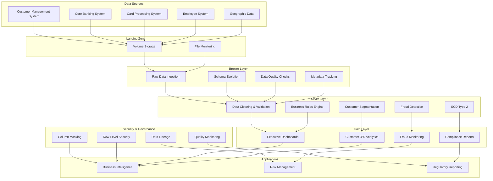
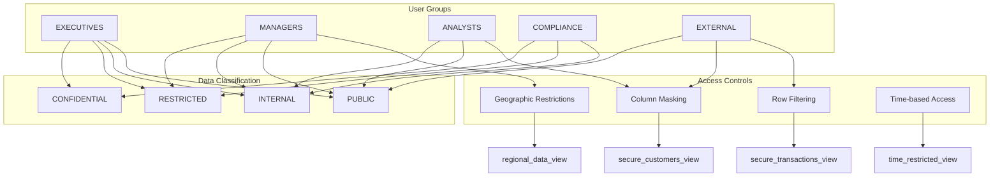

# Technical Architecture Documentation

## System Overview

The Raiffeisen Bank Data Platform is built on a modern, cloud-native architecture using Databricks Delta Live Tables, Unity Catalog, and Delta Lake storage. The platform implements a medallion (Bronze-Silver-Gold) architecture pattern with comprehensive data governance, security, and monitoring capabilities.

## Architecture Diagram



## Technology Stack

### Core Platform
- **Databricks**: Unified analytics platform
- **Delta Live Tables**: ETL pipeline framework
- **Delta Lake**: Storage layer with ACID transactions
- **Unity Catalog**: Data governance and security
- **Apache Spark**: Distributed computing engine

### Data Storage
- **Delta Format**: Columnar storage with versioning
- **Parquet**: Efficient columnar compression
- **Volume Storage**: External data landing zone
- **Change Data Feed**: Real-time change tracking

### Security & Governance
- **Unity Catalog**: Centralized access control
- **Column-level Security**: Fine-grained data masking
- **Row-level Security**: Context-aware filtering
- **Audit Logging**: Comprehensive access tracking

### Monitoring & Alerting
- **Delta Live Tables Monitoring**: Pipeline observability
- **Custom Metrics**: Business KPI tracking
- **Real-time Alerting**: Automated notification system
- **Data Quality Monitoring**: Continuous validation

## Data Model

### Bronze Layer Tables

#### customers_bronze
```sql
CREATE TABLE customers_bronze (
    customer_id STRING,
    jmeno STRING,
    prijmeni STRING,
    email STRING,
    tel_cislo STRING,
    rodne_cislo STRING,
    datum_narozeni DATE,
    prijem DECIMAL(20,2),
    -- Enhanced metadata columns
    _record_hash STRING,
    _ingestion_timestamp TIMESTAMP,
    _processing_date DATE,
    _pipeline_version STRING,
    _data_classification STRING
)
USING DELTA
PARTITIONED BY (snapshot_date, _processing_date)
```

#### Enhanced Features
- **Comprehensive Metadata**: Every record includes lineage and quality indicators
- **Data Classification**: Automatic PII and sensitive data detection
- **Schema Evolution**: Automatic handling of new columns
- **Quality Flags**: Built-in data quality scoring

### Silver Layer Tables

#### dim_customers_enhanced
```sql
CREATE TABLE dim_customers_enhanced (
    customer_id STRING,
    -- Basic demographics (masked based on user access)
    jmeno STRING,
    prijmeni STRING,
    email STRING,
    client_age INT,
    
    -- Advanced segmentation
    customer_segment STRING,
    life_stage STRING,
    wealth_segment STRING,
    banking_tenure_segment STRING,
    
    -- Risk and scoring
    overall_risk_score DOUBLE,
    risk_category STRING,
    financial_stability_score DOUBLE,
    estimated_clv_score DOUBLE,
    
    -- Behavioral indicators
    savings_rate DOUBLE,
    income_percentile_in_city DOUBLE,
    is_family_oriented BOOLEAN,
    
    -- SCD Type 2 columns
    __START_AT TIMESTAMP,
    __END_AT TIMESTAMP,
    __CURRENT BOOLEAN
)
USING DELTA
PARTITIONED BY (risk_category, customer_segment_hash)
```

#### fact_transactions_enriched
```sql
CREATE TABLE fact_transactions_enriched (
    transaction_id STRING,
    customer_id STRING,
    amount DECIMAL(20,2),
    transaction_date TIMESTAMP,
    
    -- Fraud detection features
    fraud_risk_score DOUBLE,
    fraud_risk_level STRING,
    is_amount_anomaly BOOLEAN,
    is_unusual_hour BOOLEAN,
    is_high_velocity BOOLEAN,
    
    -- Customer context at transaction time
    customer_segment_at_transaction STRING,
    customer_clv_at_transaction DOUBLE,
    
    -- Analytics features
    amount_zscore DOUBLE,
    daily_transaction_count INT,
    amount_to_income_ratio DOUBLE
)
USING DELTA
PARTITIONED BY (transaction_year, transaction_month, fraud_risk_level)
```

### Gold Layer Views

#### executive_dashboard_kpis
- **Strategic Metrics**: Customer counts, transaction volumes, revenue indicators
- **Risk Indicators**: High-risk customer counts, fraud alert volumes
- **Performance Metrics**: System health, data quality scores
- **Trend Analysis**: Month-over-month and year-over-year comparisons

#### customer_360_analytics
- **Complete Customer View**: Demographics, behavior, preferences
- **Relationship Metrics**: Account holdings, transaction patterns
- **Value Scoring**: CLV, profitability, engagement levels
- **Risk Assessment**: Credit risk, fraud risk, compliance status

## Security Architecture

### Access Control Model



### Data Masking Functions

#### Email Masking
```sql
CREATE FUNCTION mask_email(email STRING, access_level STRING)
RETURNS STRING
LANGUAGE PYTHON
AS $$
    if access_level == 'FULL':
        return email
    elif access_level == 'PARTIAL':
        # Mask username but keep domain
        return f"{email[0]}***@{email.split('@')[1]}"
    else:
        return '***@***.***'
$$;
```

#### Financial Data Masking
```sql
CREATE FUNCTION mask_amount(amount DECIMAL, user_group STRING)
RETURNS DECIMAL
LANGUAGE PYTHON  
AS $$
    if user_group in ['EXECUTIVES', 'MANAGERS']:
        return amount
    elif user_group == 'ANALYSTS':
        # Round to nearest 1000 for analysts
        return round(amount / 1000) * 1000
    else:
        return None
$$;
```

## Data Quality Framework

### Quality Dimensions

1. **Completeness**: Percentage of non-null values
2. **Validity**: Adherence to format and business rules
3. **Consistency**: Logical relationships between fields
4. **Accuracy**: Correctness of data values
5. **Uniqueness**: Absence of duplicate records
6. **Timeliness**: Data freshness and recency

### Quality Rules Engine

```python
class DataQualityRule:
    def __init__(self, name, table, column, rule_type, expression, threshold):
        self.name = name
        self.table = table  
        self.column = column
        self.rule_type = rule_type
        self.expression = expression
        self.threshold = threshold
        
    def evaluate(self, df):
        """Evaluate rule against dataframe"""
        result = df.selectExpr(self.expression).collect()[0][0]
        passed = self.compare_threshold(result)
        return {
            'rule_name': self.name,
            'measured_value': result,
            'threshold': self.threshold,
            'passed': passed
        }
```

### Automated Quality Monitoring

```python
@dlt.table(name="data_quality_results")
@dlt.expect_all({
    "completeness_check": "null_percentage <= 0.05",
    "validity_check": "invalid_records_percentage <= 0.02", 
    "consistency_check": "inconsistent_records_percentage <= 0.01"
})
def monitor_data_quality():
    # Real-time quality monitoring with automated alerts
    pass
```

## Performance Optimization

### Delta Lake Optimizations

1. **Auto Optimize**: Automatic file compaction
2. **Z-Ordering**: Data clustering for query performance  
3. **Liquid Clustering**: Dynamic clustering optimization
4. **Bloom Filters**: Efficient data skipping
5. **Partition Pruning**: Reduced data scanning

### Pipeline Performance

```python
# Optimized pipeline configuration
{
    "delta.autoOptimize.optimizeWrite": "true",
    "delta.autoOptimize.autoCompact": "true", 
    "delta.tuneFileSizesForRewrites": "true",
    "spark.databricks.delta.optimizeWrite.enabled": "true",
    "spark.databricks.delta.autoCompact.enabled": "true"
}
```

### Query Optimization

1. **Predicate Pushdown**: Filter early in pipeline
2. **Column Pruning**: Select only required columns
3. **Broadcast Joins**: Optimize small table joins
4. **Adaptive Query Execution**: Dynamic optimization
5. **Vectorized Execution**: Efficient processing

## Monitoring & Observability

### Pipeline Monitoring

```python
# Real-time pipeline metrics
@dlt.table(name="pipeline_metrics")
def monitor_pipeline_performance():
    return (
        spark.sql("""
        SELECT 
            pipeline_name,
            execution_duration_minutes,
            records_processed,
            records_per_minute,
            cpu_usage_percent,
            memory_usage_gb,
            sla_met,
            error_count
        FROM pipeline_execution_logs
        """)
    )
```

### Business KPI Monitoring

```python
# Business metrics tracking
@dlt.table(name="business_kpi_alerts") 
def monitor_business_kpis():
    return (
        spark.sql("""
        SELECT
            kpi_name,
            current_value,
            target_value,
            threshold_status,
            alert_severity,
            CASE 
                WHEN threshold_status != 'WITHIN_RANGE' THEN true
                ELSE false
            END as requires_alert
        FROM kpi_measurements
        """)
    )
```

### Alert Configuration

```yaml
alerts:
  data_quality:
    - name: "Customer Data Completeness"
      threshold: 0.95
      severity: "HIGH"
      channels: ["email", "slack"]
      
  pipeline_performance:
    - name: "Bronze Pipeline SLA"
      threshold: 30  # minutes
      severity: "CRITICAL"
      channels: ["email", "slack", "pagerduty"]
      
  fraud_detection:
    - name: "Critical Fraud Alerts"
      threshold: 1  # any critical alert
      severity: "CRITICAL"
      channels: ["email", "slack", "pagerduty"]
```

## Disaster Recovery

### Backup Strategy

1. **Delta Table Versioning**: Point-in-time recovery
2. **Cross-Region Replication**: Geographic redundancy
3. **Metadata Backup**: Unity Catalog backup
4. **Configuration Backup**: Pipeline and security settings

### Recovery Procedures

```python
# Point-in-time recovery example
def restore_table_to_timestamp(table_name, timestamp):
    spark.sql(f"""
    CREATE OR REPLACE TABLE {table_name}_restored
    AS SELECT * FROM {table_name} TIMESTAMP AS OF '{timestamp}'
    """)
```

### Business Continuity

1. **Multi-region Deployment**: Active-passive setup
2. **Automated Failover**: Health-check based switching
3. **Data Synchronization**: Real-time replication
4. **Recovery Testing**: Regular DR drills

## Compliance & Auditing

### Regulatory Requirements

1. **GDPR**: Data privacy and right to erasure
2. **PCI DSS**: Payment card data security
3. **Basel III**: Banking risk management
4. **AML**: Anti-money laundering monitoring
5. **BCBS 239**: Risk data aggregation

### Audit Trail

```sql
-- Comprehensive audit logging
CREATE TABLE audit_log (
    event_timestamp TIMESTAMP,
    user_id STRING,
    table_accessed STRING,
    operation STRING,
    rows_affected BIGINT,
    data_classification STRING,
    ip_address STRING,
    session_id STRING,
    success BOOLEAN
) USING DELTA
PARTITIONED BY (DATE(event_timestamp))
```

### Compliance Reporting

```python
@dlt.table(name="compliance_report")
def generate_compliance_report():
    return (
        spark.sql("""
        SELECT 
            regulation,
            requirement,
            asset_name,
            compliance_status,
            last_audit_date,
            next_review_date,
            risk_level
        FROM compliance_assessments
        WHERE compliance_status != 'COMPLIANT'
        """)
    )
```

This technical architecture provides a robust, scalable, and secure foundation for the Raiffeisen Bank data platform, ensuring high performance, reliability, and regulatory compliance.